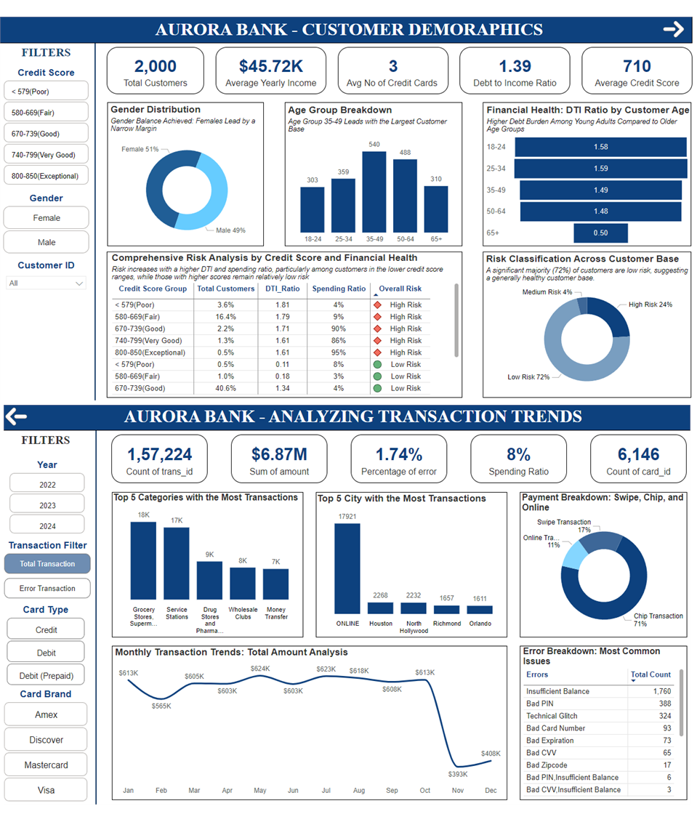

# Aurora Bank Insights 💳📊  
**Customer Segmentation & Transaction Risk Dashboard**  
*A Power BI Case Study | DataDNA Monthly Challenge – Dec 2024*

---

## 🧠 Project Overview

**Aurora Bank Insights** is a Power BI project built for the DataDNA Monthly Challenge (Dec 2024).  
This dashboard enables customer profiling, financial health monitoring, and transaction risk analysis for a fictional bank, **Aurora Bank**.

---

## 🎯 Goals

### 1. Customer Profiling & Segmentation
- Analyze demographics: age, gender, income, credit score
- Identify high-risk customers using **Debt-to-Income (DTI)** and **credit score**
- Evaluate **card ownership patterns**

### 2. Transaction Behavior & Risk Analysis
- Explore **transaction trends** by location, type, and amount
- Identify **common error types** and failure hotspots
- Detect high-risk regions and MCCs (Merchant Category Codes)

---

## 📊 Dashboard Features

- **Interactive Filters**: Credit score, Gender, Year, Transaction Type, Card Brand
- **Customer Demographics**: Gender split, Age distribution, Avg income, Risk classification
- **Risk Matrix**: Cross-tab of spending ratio, DTI, credit score
- **Transaction Trends**: Volume, Value, Error rates by city/category
- **Monthly Insights**: Transaction value trends & error breakdowns

---

## 📂 Data Details

The data is **fictional** and provided as part of the DataDNA challenge.  
It includes 4 tables:

| Table Name       | Description |
|------------------|-------------|
| `users_data`     | Customer demographics, financial metrics, credit scores |
| `transaction_data` | Transaction records with error codes and merchant locations |
| `cards_data`     | Card details including brand, chip use, expiry |
| `mcc_codes`      | Merchant category descriptions |

---

## 🛠️ Tools Used
- **Power BI**: Data modeling, DAX measures, and dashboard design

---

## 🧾 Key Insights

✅ **51% customers are female**, and the **35–49 age group dominates**  
✅ Higher DTI observed in **younger age groups**, suggesting early financial stress  
✅ **24% of customers are high risk**, mostly those with lower credit scores and higher spending  
✅ Top transaction categories: **Groceries, Services, Pharmacies**  
✅ **Chip transactions dominate (71%)**, but online and swipe are growing  
✅ **Most common transaction error**: *Insufficient balance*

---

## 📷 Dashboard Preview

---

## 🏅 Recognition

- 🧠 Received the **Storyteller Badge** for excellence in presenting insights and crafting a compelling data narrative in this Power BI project.

---

## 🤝 Acknowledgements

- [DataDNA Challenge](https://www.enterprisedna.co/datadna-showcase/) – for providing the dataset and inspiration
- Community support & learning resources from Power BI & DataDNA

---

